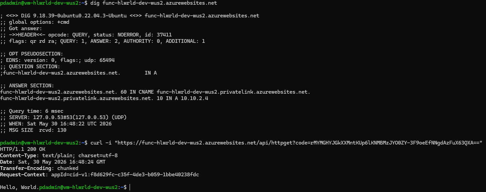

# Hello World Azure Function — Cloud Platform Engineer Challenge

Deploys a Hello World HTTP-triggered Azure Function onto infrastructure provisioned by Terraform.
The function source is Microsoft's [functions-quickstart-dotnet-azd](https://github.com/Azure-Samples/functions-quickstart-dotnet-azd) sample — no application code was modified.

---

## Repository Structure

```
.
├── .github/
│   └── workflows/
│       └── deploy.yaml          # CI/CD: lint → provision → deploy
├── function/
│   └── http/                    # Microsoft sample function source (unmodified)
│       ├── httpGetFunction.cs
│       ├── httpPostBodyFunction.cs
│       ├── Program.cs
│       ├── host.json
│       ├── http.csproj
│       └── local.settings.json
├── screenshots/
│   └── Private_Endpoint_Proof.png
├── terraform/
│   ├── main.tf                  # All Azure resources
│   ├── variables.tf
│   ├── outputs.tf
│   ├── versions.tf              # Provider + remote backend config
│   └── terraform.tfvars         # Project-specific values (committed for challenge purposes only)
└── README.md
```

---

## Prerequisites

| Tool | Version Used | Install |
|---|---|---|
| Azure CLI | 2.83.0 | `sudo dnf install azure-cli` |
| Terraform | 1.15.5 | [HashiCorp repo](https://rpm.releases.hashicorp.com/fedora/hashicorp.repo) |
| Azure Functions Core Tools | 4.12.0 | See below |
| .NET SDK | 10.0 | `sudo dnf install dotnet-sdk-10.0` |

### Azure Functions Core Tools (Linux/WSL)

```bash
mkdir -p ~/azure-functions-cli
wget -O Azure.Functions.Cli.linux-x64.4.12.0.zip \
  https://github.com/Azure/azure-functions-core-tools/releases/download/4.12.0/Azure.Functions.Cli.linux-x64.4.12.0.zip
unzip -d ~/azure-functions-cli Azure.Functions.Cli.linux-x64.4.12.0.zip
chmod +x ~/azure-functions-cli/func
echo 'export PATH="$HOME/azure-functions-cli:$PATH"' >> ~/.bashrc
source ~/.bashrc
```

### Verify installations

```bash
az --version       # azure-cli 2.83.0
terraform --version  # Terraform v1.15.5
func --version     # 4.12.0
dotnet --version   # 10.0.108
```

---

## Infrastructure (Terraform)

All resources are deployed under the **Consumption (Free / Y1) plan**.

| Resource | Name |
|---|---|
| Resource Group | `rg-hlwrld-dev-wus2` |
| Storage Account | `sthlwrlddevwus2` |
| Log Analytics Workspace | `log-hlwrld-dev-wus2` |
| Application Insights | `appi-hlwrld-dev-wus2` |
| App Service Plan (Y1) | `asp-hlwrld-dev-wus2` |
| Function App (Windows) | `func-hlwrld-dev-wus2` |

Naming convention: `{type}-{project}-{environment}-{region}` (storage accounts omit hyphens due to Azure constraints).

Tags applied to all resources:

```hcl
tags = {
  environment = "dev"
  owner       = "patrick-daley"
  project     = "hello-world-challenge"
}
```

### Terraform State

State is stored remotely in an Azure Blob Storage container that was manually created prior to Terraform execution. This storage account is intentionally outside Terraform management — it must exist before `terraform init` can run.

```
Storage Account : pdaleyterraformstates
Resource Group  : azure-terraform-states
Container       : tfstate
Key             : hlwrld-dev.tfstate
```

> **Note on `dotnet_version`:** The `site_config` block in `main.tf` declares `dotnet_version = "v8.0"`. The function project targets `net10.0`. For `dotnet-isolated` functions, the published binary determines the actual runtime; the `dotnet_version` field is informational and does not block deployment. The function deploys and runs correctly.

---

## Deployment Steps

### 1. Authenticate to Azure

```bash
az login
export ARM_SUBSCRIPTION_ID="<MY SUBSCRIPTION ID>"
```

### 2. Initialize Terraform

```bash
cd terraform
terraform init
```

### 3. Apply Terraform

```bash
terraform plan
terraform apply
```

This provisions all Azure resources. The Function App will exist but have no code deployed yet.

### 4. Deploy the Function

```bash
cd ../function/http
func azure functionapp publish func-hlwrld-dev-wus2 --dotnet-isolated
```

After a successful publish, list deployed functions and retrieve the invoke URL:

```bash
func azure functionapp list-functions func-hlwrld-dev-wus2 --show-keys
```

---

## Validation

```bash
curl "https://func-hlwrld-dev-wus2.azurewebsites.net/api/httpget?code=<YOUR_FUNCTION_KEY>"
```

Expected response:

```
Hello, World.
```

---

## CI/CD Pipeline

The `.github/workflows/deploy.yaml` pipeline runs automatically on every push to `main`.

**Jobs:**

1. **Lint & Validate** — runs on all PRs and pushes. Runs `dotnet build`, `terraform fmt -check`, and `terraform validate`.
2. **Terraform Plan & Apply** — runs on push to `main` only. Provisions or updates Azure infrastructure.
3. **Deploy Azure Function** — runs on push to `main` only, after provisioning. Publishes the function via `func azure functionapp publish`.

**Authentication:** GitHub Actions authenticates to Azure via OIDC federated credentials (no stored client secret). The App Registration (`sp-coding-challenge-github`) is intentionally managed outside Terraform — it must exist before Terraform can run.

**GitHub Secrets required:**

| Secret | Description |
|---|---|
| `AZURE_CLIENT_ID` | App Registration client ID |
| `AZURE_TENANT_ID` | Azure AD tenant ID |
| `AZURE_SUBSCRIPTION_ID` | Azure Subscription ID |
| `AZURE_FUNCTION_APP_NAME` | `func-hlwrld-dev-wus2` |

Setting secrets via CLI:

```bash
az account show --query "tenantId" -o tsv | gh secret set AZURE_TENANT_ID
az account show --query "id" -o tsv       | gh secret set AZURE_SUBSCRIPTION_ID
az ad sp list --display-name "sp-coding-challenge-github" --query "[0].appId" -o tsv | gh secret set AZURE_CLIENT_ID
gh secret set AZURE_FUNCTION_APP_NAME --body "func-hlwrld-dev-wus2"
```

Give the service principal access to the Terraform state storage account:

```bash
az role assignment create \
  --assignee $(az ad sp list --display-name "sp-coding-challenge-github" --query "[0].appId" -o tsv) \
  --role "Storage Blob Data Contributor" \
  --scope $(az storage account show --name pdaleyterraformstates --query "id" -o tsv)
```

---

## Bonus — Private Endpoint

`terraform/bonus.tf` contains the complete configuration for a private endpoint, commented out to avoid ongoing costs on the Consumption plan.

**What it provisions:**

- VNet (`vnet-hlwrld-dev-wus2`) with two subnets: `snet-vm` and `snet-pe`
- Network Security Group allowing SSH only from a trusted source CIDR (`var.ssh_source_cidr`)
- Linux VM (`vm-hlwrld-dev-wus2`) with SSH key auth, no password
- Private Endpoint (`pe-func-hlwrld-dev-wus2`) for the Function App data plane (`sites`)
- Private DNS Zone (`privatelink.azurewebsites.net`) linked to the VNet

**Access model:**

- SSH into the VM via its public IP (locked to `var.ssh_source_cidr`)
- From inside the VM, `curl` resolves the Function App to its private IP via the privatelink DNS zone
- Public access to the Function App is left enabled per the challenge spec

**Assumptions and constraints:**

- Private Endpoints on Azure Functions require a paid plan (EP1 or higher). The commented-out `sku_name = "EP1"` line in `main.tf` shows what to switch to. Enabling this **will incur costs**.
- The bonus VM uses `Standard_D2s_v3` as specified during testing.
- Bonus variables (`ssh_source_cidr`, `vm_ssh_public_key`) are injected at apply time via GitHub Actions secrets — they are never committed to the repository.

**Proof of working private endpoint:**



The `dig` output confirms the Function App URL resolves to its private endpoint IP. The `curl` from inside the VM returns the expected "Hello, World." response.

**To enable the bonus:**

1. Uncomment the contents of `bonus.tf`
2. In `main.tf`, switch `sku_name = "Y1"` to `sku_name = "EP1"`
3. Add the two bonus GitHub secrets: `TF_VAR_ssh_source_cidr` and `TF_VAR_vm_ssh_public_key`
4. Run `terraform apply`

---

## Cleanup

Remove all resources created by Terraform:

```bash
cd terraform
terraform destroy
```

This removes the resource group and everything inside it. Two objects persist after destroy (created manually, outside Terraform):

- The GitHub Actions App Registration (`sp-coding-challenge-github`)
- The Terraform state Storage Account (`pdaleyterraformstates`)

---

## Security Notes

- **`terraform.tfvars` is committed** — this is intentional for this challenge only. In a real project it would be listed in `.gitignore` and values would be supplied via CI/CD secrets or a secrets manager. 
- The Storage Account disables public blob access (`allow_nested_items_to_be_public = false`).
- The Function App uses function-level auth keys (`AuthorizationLevel.Function`) — the invoke URL requires a `code` query parameter.
- No credentials are hardcoded in application code or workflow files.
- The GitHub Actions service principal uses OIDC (federated identity), not a long-lived client secret.
